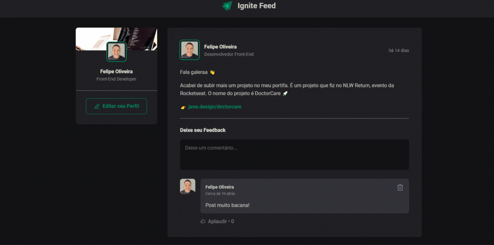

<h1 align="center"> Ignite Feed </h1>

Ignite Feed é um projeto desenvolvido junto com o Diego Fernandes da Rocket Seat no Curso de ReactJS no caminho Ignite.  

  <a href="#-tecnologias">Tecnologias</a>&nbsp;&nbsp;&nbsp;|&nbsp;&nbsp;&nbsp;
  <a href="#-projeto">Projeto</a>&nbsp;&nbsp;&nbsp;|&nbsp;&nbsp;&nbsp;
  <a href="#-layout">Layout</a>&nbsp;&nbsp;&nbsp;|&nbsp;&nbsp;&nbsp;
  <a href="#memo-licença">Licença</a>

  

 

  

## 🚀 Tecnologias

Esse projeto foi desenvolvido com as seguintes tecnologias:

- HTML e CSS
- JavaScript
- ReactJS
- TypeScript
- Git e Github
- Figma

## 💻 Projeto

O Ingnite Feed é uma página que contém um Feed de postagem de mensagem, com área para postar comentários e opções de "deletar" e "aplaudir" caso tenha gostado dom comentário postado.

- [Visite o projeto online](https://ignite-react-project1-ts.netlify.app)

## 🔖 Layout

Você pode visualizar o layout do projeto através [DESSE LINK](https://www.figma.com/file/BsbNb6MyvuyK79QRqVxDyg/Ignite-Feed-(Community)?node-id=0-1&t=ImiXRaDM0PdZojIN-0). É necessário ter conta no [Figma](https://figma.com) para acessá-lo.

## 📝 Licença

Esse projeto está sob a licença MIT.

---

Feito por Felipe Olivera com a tutoria de Diego Fernandes da Rocketseat 👋 [Participe da comunidade Rocketseat!](https://discord.gg/rocketseat)
